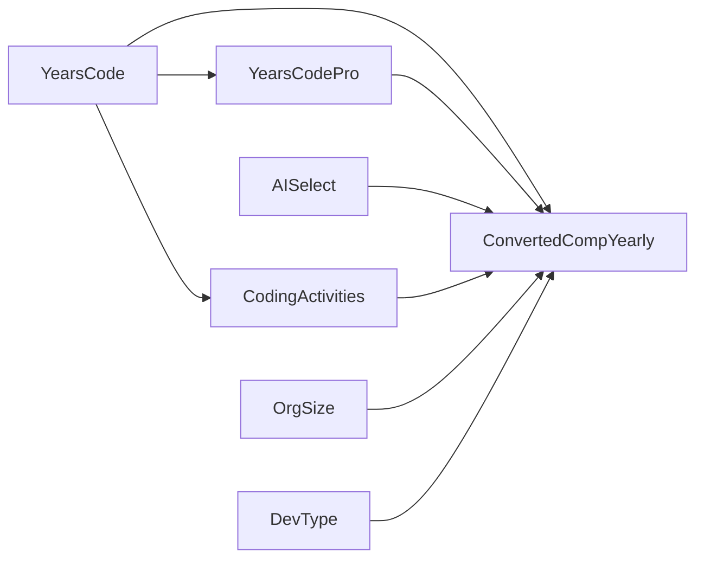
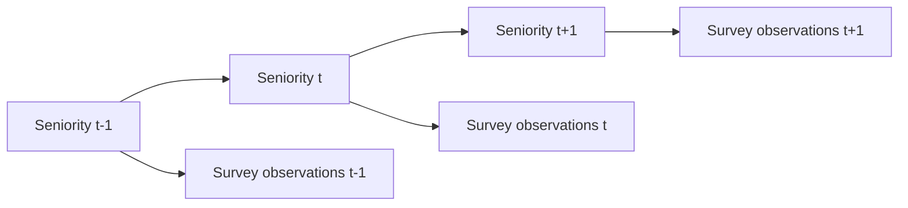

# CSE 150A: Bayesian Network and HMM for Developer Skill Modeling

## Team Members

- Lianna Lim
- Ved Panse
- William Diego
- Ioanna Gkerdouki
- Iha Gadiya

## 1. Introduction

### Project Overview
This project explores three probabilistic modeling approaches: Bayesian Networks (BNs), Hidden Markov Models (HMMs), and Markov Decision Processes (MDPs). We demonstrate how each addresses a different aspect of reasoning under uncertainty. The Bayesian Network models the relationships among developer characteristics such as experience, AI tool usage, coding activities, and compensation, allowing us to perform probabilistic inference on developer outcomes. Building on this idea, the Hidden Markov Model introduces a latent seniority variable and captures how hidden career stages influence observable survey responses over a sequential career-progression ordering. Finally, the Markov Decision Process extends probabilistic reasoning from prediction to decision making by enabling an agent to learn optimal actions in a Minecraft environment through rewards, state transitions, and planning algorithms. Together, these three models illustrate a progression from static probabilistic inference (BN), to temporal probabilistic modeling (HMM), to sequential decision making under uncertainty (MDP).

### Problem Statement and PEAS Analysis

Our project is about predicting a developer's programming skill category from survey variables. The survey does not directly ask for "programming skill," so we use yearly compensation (`ConvertedCompYearly`) as a proxy. This is not a perfect measure of skill, but it is a useful outcome variable because compensation is often related to experience, role, and professional ability.

The problem we are solving is: given a developer's experience, AI tool usage, role, and coding activity, how likely are they to fall into each compensation/skill category?
Note: the developers being analyzed is generalized to those in the United States and in medium-sized organizations

Probabilistic modeling makes sense here because the relationship of amount of learning and company compensation is uncertain. For example, two developers can both have 10+ years of coding experience but still have different salaries because of their role, company, practice habits, or other factors not in the dataset. A Bayesian Network is useful because it lets us represent these uncertain relationships and ask probability questions such as:

```text
P(ConvertedCompYearly | AISelect = yes)
```

#### Bayesian Network PEAS

- **Performance measure:** Accuracy when predicting the compensation/skill category on held-out test data. We also compare against a majority-class baseline.
- **Environment:** Professional developers from the United States who work at companies with 1,000 to 4,999 employees.
- **Actuators:** The agent outputs a probability distribution over compensation/skill categories and predicts the most likely category.
- **Sensors:** `AISelect`, `YearsCode`, `YearsCodePro`, `CodingActivities`, `DevType`, `OrgSize`, and `ConvertedCompYearly`.

#### HMM PEAS

For this milestone, the agent's task is to infer a developer's latent seniority state from observable survey responses.

- **Performance measure:** Sequence log-likelihood and Viterbi decoded-state accuracy against an experience-based proxy label.
- **Environment:** Professional developers in the filtered Stack Overflow survey dataset.
- **Actuators:** The agent outputs a decoded seniority state sequence and probability parameters for the HMM.
- **Sensors:** `DevType`, `AISelect`, `YearsCode`, `CodingActivities`, and `ConvertedCompYearly`.

Probabilistic modeling makes sense because seniority is not directly measured in the survey. The observed variables are noisy indicators: experience, role, coding habits, AI tool usage, and compensation can all relate to career stage, but none perfectly identifies true seniority.

#### MDP PEAS

- **Performance measure:** Cumulative reward per episode; convergence of Policy Iteration and Value Iteration; successful progression through the Minecraft tech tree (wood → tools → mining).
- **Environment:** A live Minecraft server where the bot observes position, inventory, health, and nearby blocks.
- **Actuators:** The agent selects from 186 possible actions including movement, mining, crafting, and combat.
- **Sensors:** Grid position, health bin, food bin, inventory contents, nearby blocks, and available actions.

## 2. Dataset & Preprocessing

### Dataset Source and Size

We used the Stack Overflow Developer Survey 2023 dataset from Kaggle:
https://www.kaggle.com/datasets/mahdialfred/stack-overflow-developer-survey-2023

Our cleaned dataset is in `cleaned_data/cleaned_stackoverflow_bn_data.csv`. The data cleaning work is in `src/data_cleaning.ipynb`, and the Bayesian Network code is in `src/bayesian_net.ipynb`.

The Markov Decision Process component uses a Minecraft environment provided through the starter code repository available at: https://github.com/ucsd-cse150a-s26/minecraft-mdp-agent-student-starter-code.  Unlike the survey dataset, the Minecraft environment generates observations dynamically as the agent interacts with the world. 

### Task Definition
Each model addresses a different task:

- **Bayesian Network (BN):** Predict a developer's compensation category, which we use as a proxy for programming skill, from observable survey features.

- **Hidden Markov Model (HMM):** Infer a developer's latent seniority level (*junior*, *mid-level*, or *senior*) from observable survey responses.

- **Markov Decision Process (MDP):** Learn a policy that maximizes cumulative reward in a Minecraft environment through sequential decision making.

### Data Types 
The Stack Overflow dataset contains primarily categorical variables after preprocessing. Several originally numeric variables, such as YearsCode, YearsCodePro, and ConvertedCompYearly, were discretized into categorical groups for use in the Bayesian Network and HMM.

The Minecraft environment contains mixed observations including positional information, inventory information, health status, environmental features, and available actions. These observations are discretized into a finite state representation for the MDP.

### Preprocessing

We started with the full Stack Overflow survey and narrowed it down so that the final dataset was more consistent. We kept rows where:

- `Country` was `United States of America`
- `OrgSize` was `1,000 to 4,999 employees`
- `DevType` contained `Developer`
- The selected columns did not have missing values

After cleaning, the final dataset has **1,106 rows**.

### Variables Used

| Variable | Values after cleaning | Role |
| --- | --- | --- |
| `Country` | `USA` | Used for filtering; dropped before training because it is constant |
| `OrgSize` | `medium_size` | Company size; kept in the model, but it is constant after filtering |
| `DevType` | `full_stack`, `back_end`, `front_end`, `mobile`, `applications`, `embedded`, `qa`, `advocate`, `game_graphics`, `experience` | Developer role |
| `AISelect` | `yes`, `no`, `plan_to` | Whether the developer uses or plans to use AI tools |
| `YearsCode` | `low`, `medium`, `high` | Total coding experience |
| `YearsCodePro` | `low`, `medium`, `high` | Professional coding experience |
| `CodingActivities` | `codes_as_hobby`, `no_code_as_hobby` | Whether the developer codes outside work |
| `ConvertedCompYearly` | `low`, `medium`, `high`, `very_high` | Target variable; used as our skill proxy |

### Dataset Exploration

The most important counts in the cleaned data were:

| Variable | Counts |
| --- | --- |
| `DevType` | full_stack 512, back_end 304, applications 80, front_end 77, embedded 44, mobile 38, and smaller groups for the rest |
| `AISelect` | no 422, yes 388, plan_to 296 |
| `YearsCode` | high 830, medium 274, low 2 |
| `YearsCodePro` | high 596, medium 422, low 88 |
| `CodingActivities` | codes_as_hobby 784, no_code_as_hobby 322 |
| `ConvertedCompYearly` | very_high 312, medium 280, low 273, high 241 |

The target classes are fairly balanced because we used quartiles for compensation: `very_high` is 28.21%, `medium` is 25.32%, `low` is 24.68%, and `high` is 21.79%.

### Thresholding and Discretization

Bayesian Networks with CPTs need discrete variables, so we discretized the numeric-like fields.

For `YearsCode` and `YearsCodePro`, we converted text responses first:

- `"Less than 1 year"` became `0.5`
- `"More than 50 years"` became `51`

Then we used these bins:

- `low`: fewer than 3 years
- `medium`: 3 to fewer than 10 years
- `high`: 10 or more years

We chose these cutoffs because they roughly separate beginner, intermediate, and experienced developers. One limitation is that after filtering, only 2 rows are in the `YearsCode = low` group, so this state is very sparse.

For `ConvertedCompYearly`, we used quartiles:

- `low`: below Q1
- `medium`: Q1 to below the median
- `high`: median to below Q3
- `very_high`: Q3 and above

We used quartiles instead of fixed salary ranges because the salary distribution is skewed, and quartiles give us a more balanced target variable.

We also simplified two survey fields. `CodingActivities` became whether the respondent codes as a hobby, and `AISelect` became `yes`, `no`, or `plan_to`.

### HMM Temporal Data Construction

The Stack Overflow data is cross-sectional, so it does not have a true timestamp. To make it usable for an HMM, we imposed a career-progression ordering. Rows are sorted by `YearsCodePro` and then `YearsCode`, using the order `low -> medium -> high`. This creates a sequence from less professionally experienced developers to more professionally experienced developers.

The continuous year fields were already discretized into `low`, `medium`, and `high` using the same bins as the Bayesian Network:

- `low`: fewer than 3 years
- `medium`: 3 to fewer than 10 years
- `high`: 10 or more years

The emission at each time step is a composite discrete symbol made by combining `DevType`, `AISelect`, `YearsCode`, `CodingActivities`, and `ConvertedCompYearly`. We did not include `YearsCodePro` in the emission symbol because it is used as the proxy label for evaluation.

### MDP State Space Design

**State Space (S):**

Our state is a 12-tuple representing the bot's situation:

| Index | Feature | Description |
|-------|---------|-------------|
| 0-1 | `gx`, `gz` | Grid position (bucketed by 10 blocks) |
| 2 | `health_bin` | Health level (0-3) |
| 3 | `food_bin` | Food/hunger level (0-3) |
| 4 | `wood_bucket` | Amount of wood logs (0-3) |
| 5 | `has_planks` | Boolean: has planks in inventory |
| 6 | `has_sticks` | Boolean: has sticks in inventory |
| 7 | `has_stone` | Boolean: has cobblestone |
| 8 | `has_table_nearby` | Boolean: crafting table within 4 blocks |
| 9 | `has_wood_pickaxe` | Boolean: owns wooden pickaxe |
| 10 | `has_stone_pickaxe` | Boolean: owns stone pickaxe |
| 11 | `has_iron_pickaxe` | Boolean: owns iron pickaxe |

## 3. Methods

### 3.1 Bayesian Network (BN)

#### Bayesian Network Structure

Our final DAG is:



We chose `YearsCode -> YearsCodePro` because total coding experience usually comes before professional experience. We also chose `YearsCode -> CodingActivities` because coding experience may be related to whether someone codes outside of work.

`ConvertedCompYearly` is the target node. Its parents are `YearsCode`, `YearsCodePro`, `AISelect`, `CodingActivities`, `OrgSize`, and `DevType`. We chose these because salary can reasonably depend on experience, AI tool use, outside coding activity, company size, and role. We kept the network fairly simple because a more complicated DAG would make the CPTs harder to estimate with only 1,106 rows.

#### Conditional Independence Testing

We used chi-square tests on contingency tables to check some of the main relationships before finalizing the graph.

| Relationship tested | Chi-square | p-value | What we took from it |
| --- | ---: | ---: | --- |
| `YearsCode` vs. `YearsCodePro` | 486.7506 | < 0.0001 | Strong relationship, so we kept `YearsCode -> YearsCodePro` |
| `AISelect` vs. `ConvertedCompYearly` | 1.7813 | 0.9387 | Weak pairwise relationship, but we kept it because AI usage is our main project question |
| `YearsCode` vs. `CodingActivities` | 8.3280 | 0.0155 | Some evidence of a relationship, so we kept `YearsCode -> CodingActivities` |
| `DevType` vs. `ConvertedCompYearly` | 76.1941 | < 0.0001 | Strong relationship, so we kept `DevType -> ConvertedCompYearly` |

The strongest statistical support was for experience-related variables and developer role. The AI edge is less supported by this pairwise test, so our results about AI should be interpreted carefully.

#### Parameter Learning

The model learns Conditional Probability Tables (CPTs) from the training data. We used Maximum Likelihood Estimation through pgmpy.

For a node \(X\) with parents \(Pa(X)\), the CPT is computed as:

```text
P(X = x | Pa(X) = u) = count(X = x and Pa(X) = u) / count(Pa(X) = u)
```

For a root node, the formula is:

```text
P(X = x) = count(X = x) / N
```

We used a 70/30 train-test split with `random_state=42`. This gave us **774 training rows** and **332 test rows**. The fitted model passed `model.check_model()`, so the learned CPTs formed a valid Bayesian Network.

#### Improvements from Milestone 4

We retained the Bayesian Network structure and parameters as it achieved 34.85% accuracy. This outperformed the majority-class baseline (29.5%), confirming that the model captured meaningful relationships in the data.

### 3.2 Hidden Markov Model (HMM)

#### HMM Model Structure



Each observation node is a composite symbol containing `DevType`, `AISelect`, `YearsCode`, `CodingActivities`, and `ConvertedCompYearly`.

#### Latent Variable Identification

The latent variable is **Developer Seniority**, with hidden states interpreted as junior, mid-level, and senior. This variable is latent because the Stack Overflow survey does not contain a verified seniority column or objective skill assessment. Instead, seniority is inferred from observed features such as coding experience, professional role, coding outside work, AI tool usage, and compensation. In the Bayesian Network, seniority is related to the experience and compensation structure, but it was not explicitly represented as a measured node. In the HMM, seniority becomes the hidden state, and the survey variables become emissions generated by that state.

#### HMM Parameter Estimation

We implemented a basic discrete HMM with three hidden states and 235 composite observation symbols. Parameters are estimated with the Baum-Welch EM algorithm:

- E-step: scaled forward-backward inference estimates posterior state responsibilities.
- M-step: expected counts update the initial distribution `pi`, transition matrix `A`, and emission matrix `B`.

The fitted initial distribution was:

| State | `pi` |
| --- | ---: |
| junior | 0.0000 |
| mid_level | 1.0000 |
| senior | 0.0000 |

The fitted transition matrix was:

| From \ To | junior | mid_level | senior |
| --- | ---: | ---: | ---: |
| junior | 0.0000 | 0.0026 | 0.9974 |
| mid_level | 0.0072 | 0.9928 | 0.0000 |
| senior | 0.8524 | 0.0000 | 0.1476 |

The emission matrix `B` has shape `3 x 235`, with one row per hidden seniority state and one column per composite observation symbol.

#### HMM Inference

We used the forward algorithm to compute the likelihood of the full observation sequence and the Viterbi algorithm to decode the most likely hidden seniority sequence. Since HMM state labels are arbitrary, decoded states were aligned to the junior, mid-level, and senior proxy labels using the best one-to-one confusion-matrix assignment.

#### Improvements from Milestone 5

We improved the temporal ordering of observations by using YearsCode as a tiebreaker when sorting samples with identical YearsCodePro instead of omitting the variable.  This provides a more realistic career progression sequence for the HMM to learn from.

### 3.3 Markov Decision Process (MDP)

#### MDP Formulation

**Action Space (A):**

186 actions provided by the Minecraft environment, including movement (north, south, east, west), mining actions (mine_below, mine_forward, mine_coal, mine_iron, mine_diamond), crafting actions (craft_planks, craft_sticks, craft_wooden_pickaxe, craft_stone_pickaxe), and utility actions (climb_up, eat, chop_wood).

**Reward Function R(s, a, s'):**

We designed rewards to guide the bot through the Minecraft tech tree:

| Action/Event | Reward |
|--------------|-------:|
| Base step cost | -0.1 |
| Collect wood | +4.0 per bucket |
| Craft planks (first time) | +8.0 |
| Craft sticks | +6.0 |
| Collect cobblestone | +10.0 |
| Mine coal | +12.0 |
| Craft wooden pickaxe | +15.0 |
| Mine iron | +16.0 |
| Smelt iron | +20.0 |
| Craft stone pickaxe | +25.0 |
| Craft iron pickaxe | +35.0 |
| Mine diamond | +100.0 |
| Losing health | -3.0 |
| Digging down (trap risk) | -3.0 |
| Climbing up (escape) | +3.0 |
| No state change | -0.25 |

**Discount Factor (γ):** 0.99

**Transition Model T(s, a, s'):**

We use count-based estimation from experience:

```
T̂(s,a,s') = count(s,a,s') / count(s,a)
```

The agent starts with a self-loop prior (assumes nothing changes) and updates the transition matrix as it observes real state transitions in the environment.

#### Policy Iteration

Policy Iteration alternates between two phases until convergence:

1. **Policy Evaluation:** Compute V^π for the current policy using the Bellman expectation equation:
   ```
   V^π(s) = Σ_{s'} T(s, π(s), s') · [R(s, π(s), s') + γ · V^π(s')]
   ```

   Note: Default theta of 1e-4

2. **Policy Improvement:** Update the policy greedily based on the computed values:
   ```
   π'(s) = argmax_a Σ_{s'} T(s,a,s') · [R(s,a,s') + γ · V(s')]
   ```

The algorithm terminates when the policy stops changing, indicating convergence to the optimal policy.

#### Value Iteration

Value Iteration directly computes optimal state values using the Bellman optimality equation:

```
V_{k+1}(s) = max_a [Σ_{s'} T(s,a,s') · (R(s,a,s') + γ · V_k(s'))]
```

The algorithm iterates until the value function converges (max change falls below a threshold), then extracts the greedy policy from the final values.

Note: Default theta of 1e-6. This theta is smaller than the value used for policy evalution as this ensures the policy with the greatest state-action function value is found. policy improvement can compensate for a looser threshold for  policy evaluation.

#### Exploration Strategy

Our initial epsilon value is 0.5. We implemented a decay function of :

```
epsilon = max(0.05, epsilon * 0.995)
```

with a minimum floor value of 0.5.

#### Connection to HMM

The transition matrix of a MDP and the transition matrix of a HMM follow the Markov property such that given the state at time t is conditionally independent of all previous states given the state at t-1. The MDP transition matrix also involves the previous state's action giving a conditional property of:

```
$$T(s, a, s') = P(S_t = s' \mid S_{t-1} = s, A_{t-1} = a)$$
```

## 4. Training & Implementation

### BN Training

The full code is in `src/bayesian_net.ipynb`. The main training code is:

```python
from pgmpy.models import DiscreteBayesianNetwork
from pgmpy.parameter_estimator import DiscreteMLE
from pgmpy.inference import VariableElimination
from sklearn.model_selection import train_test_split
import pandas as pd

data = pd.read_csv("../cleaned_data/cleaned_stackoverflow_bn_data.csv")
data = data.drop(columns=["Country"])

edges = [
    ("YearsCode", "YearsCodePro"),
    ("YearsCode", "CodingActivities"),
    ("YearsCode", "ConvertedCompYearly"),
    ("YearsCodePro", "ConvertedCompYearly"),
    ("AISelect", "ConvertedCompYearly"),
    ("CodingActivities", "ConvertedCompYearly"),
    ("OrgSize", "ConvertedCompYearly"),
    ("DevType", "ConvertedCompYearly"),
]

model = DiscreteBayesianNetwork(edges)
train_data, test_data = train_test_split(data, test_size=0.3, random_state=42)
model.fit(train_data, estimator=DiscreteMLE())
inference = VariableElimination(model)
```

Note: Test and train dataset split was 70/30 based on common industry standards. 

pgmpy is the library we used to create the Bayesian Network, learn the CPTs, check that the model is valid, and run inference with variable elimination.

### HMM Training

The HMM was implemented in `src/hmm_model.py` and documented in `src/hmm.ipynb`. The HMM uses the same cleaned Stack Overflow survey data, but it models a sequence of hidden career-stage states rather than a static Bayesian Network.

| Metric | Value |
| --- | ---: |
| EM iterations | 100 |
| Final sequence log-likelihood | -4726.0322 |
| Log-likelihood per observation | -4.2731 |

### MDP Training

The MDP code is in `minecraft-mdp-agent-student-starter-code-main/student/`.

- **Episodes:** 100 per training run
- **Max steps per episode:** 500
- **Checkpointing:** Every 5 episodes, the transition matrix and policy are saved to a pickle file
- **Resume capability:** Training can be stopped and resumed from the latest checkpoint

Note : All hyperparameters, specifically iterations and steps, where used as provided in the starter code.

## 5. Results & Discussion

### 5.1 Bayesian Network Results

#### Inference Examples

Here are three example queries from the trained model.

**Query 1: AI tool users**

`P(ConvertedCompYearly | AISelect = yes)`

| Category | Probability |
| --- | ---: |
| high | 0.2453 |
| low | 0.2168 |
| medium | 0.2483 |
| very_high | 0.2896 |

**Query 2: Non-users**

`P(ConvertedCompYearly | AISelect = no)`

| Category | Probability |
| --- | ---: |
| high | 0.2036 |
| low | 0.2494 |
| medium | 0.2777 |
| very_high | 0.2693 |

**Query 3: High professional experience and AI use**

`P(ConvertedCompYearly | YearsCodePro = high, AISelect = yes)`

| Category | Probability |
| --- | ---: |
| high | 0.2468 |
| low | 0.1386 |
| medium | 0.2418 |
| very_high | 0.3728 |

The model gives AI users a slightly higher probability of being in the `very_high` category than non-users, but the difference is small. The query with high professional experience has a clearer effect: `very_high` increases to 0.3728.

#### Evaluation Results

For each row in the test set, we used all variables except `ConvertedCompYearly` as evidence and predicted the category with the highest posterior probability. Two test rows had unseen states from training, so they were skipped.

| Metric | Value |
| --- | ---: |
| Test rows | 332 |
| Valid predictions | 330 |
| Skipped rows | 2 |
| Correct predictions | 115 |
| Bayesian Network accuracy | 34.85% |
| Majority-class baseline accuracy | 29.52% |
| Improvement over baseline | +5.3 percentage points |

Confusion matrix:

| Actual \ Predicted | high | low | medium | very_high |
| --- | ---: | ---: | ---: | ---: |
| high | 28 | 8 | 8 | 19 |
| low | 28 | 21 | 24 | 15 |
| medium | 31 | 6 | 21 | 23 |
| very_high | 28 | 12 | 13 | 45 |

#### Interpretation

The Bayesian Network did better than the majority-class baseline, but only by about 5.3 percentage points. This means the model is learning some signal, but it is not a very strong predictor yet.

The model has trouble separating nearby compensation categories. This makes sense because salary is affected by many things we did not include, such as exact location, education, company pay policy, seniority level, industry, negotiation, and management responsibilities. Also, salary is only a proxy for programming skill, not a direct measurement.

The AI result should also be treated carefully. The chi-square test for `AISelect` and `ConvertedCompYearly` had a high p-value, so AI usage by itself did not show a strong relationship with compensation in this filtered dataset. The Bayesian Network query shows a small difference between AI users and non-users, but this is not enough to claim that AI tools cause higher skill or higher compensation.

### 5.2 Hidden Markov Model Results

| Metric | Value |
| --- | ---: |
| EM iterations | 100 |
| Final sequence log-likelihood | -4726.0322 |
| Log-likelihood per observation | -4.2731 |
| Viterbi seniority proxy accuracy | 47.74% |

HMM confusion matrix:

| Experience proxy \ Decoded HMM state | junior | mid_level | senior |
| --- | ---: | ---: | ---: |
| junior | 8 | 72 | 8 |
| mid_level | 102 | 205 | 115 |
| senior | 281 | 0 | 315 |

#### Interpretation

The HMM recovered some career-stage structure, but the decoded seniority sequence is imperfect. The 47.74% proxy accuracy should be interpreted cautiously because `YearsCodePro` is not true ground truth; it is only an experience-based approximation of seniority. Also, the dataset has many senior developers and relatively few junior developers, so the hidden states are not equally easy to recover.

Compared with the Bayesian Network, the HMM captures ordering. The BN treats each respondent as an independent row in a static dependency graph. The HMM instead models a sequence through latent seniority regimes and learns transition probabilities between those regimes. This allows sequential inference, such as scoring the whole observation sequence or decoding a likely hidden-state path.

The BN and HMM performance numbers are not directly interchangeable because they predict different quantities: the BN predicts compensation category, while the HMM decodes latent seniority states and is evaluated against an experience proxy. Still, they show complementary behavior. The BN achieved 34.85% compensation-category accuracy against a 29.52% majority baseline, while the HMM achieved 47.74% decoded seniority proxy accuracy and a log-likelihood of -4.2731 per observation.

The HMM also imposes assumptions the BN did not require. It assumes a meaningful row ordering, a first-order Markov dependency between hidden states, and emissions that depend only on the current hidden state. Since this survey is not truly longitudinal, our sequence is a career-progression proxy rather than a record of the same developers over time. The HMM is therefore useful for exploring latent regimes, but its transitions should not be interpreted as literal career transitions.

### 5.3 MDP Results

#### Policy Analysis

The learned policy follows the expected Minecraft progression:

1. Find and chop wood (get_wood or chop_wood actions)
2. Craft planks from wood
3. Craft sticks from planks
4. Place crafting table and craft wooden pickaxe
5. Mine cobblestone with wooden pickaxe
6. Craft stone pickaxe
7. Mine iron ore with stone pickaxe
8. Smelt iron and craft iron pickaxe
9. Progress toward diamond mining

The reward shaping successfully taught the bot to:
- Avoid digging straight down (which can trap it in holes)
- Use the climb_up action to escape when stuck
- Prioritize tool progression over random exploration

#### Training Artifacts and Quantitative Results

The generated MDP plots and metrics are committed under
`minecraft-mdp-agent-student-starter-code-main/results/analysis/`.

| Artifact | File |
|---------|------|
| Metrics summary | `sharpyew_kz_metrics_summary.md` |
| Learning curve / cumulative reward | `sharpyew_kz_rewards.png` |
| State and transition growth | `sharpyew_kz_growth.png` |
| State visitation heatmap | `sharpyew_kz_state_heatmap.png` |
| Per-episode metrics data | `sharpyew_kz_episode_metrics.csv` |
| State heatmap data | `sharpyew_kz_state_heatmap.csv` |

From the final training checkpoint (`sharpyew_kz_ep765.pkl`), the bot visited
7,632 unique states and learned 374,389 transition statistics. The logged
training run covered episodes 16 through 765. The best episode reward was
1907.1, the recent 10-episode average reward was -51.9, and Policy Iteration
and Value Iteration agreed on 7,506 out of 7,632 states (98.35%). As a baseline
comparison, the first 50 high-exploration episodes averaged -1442.0 reward,
while the last 50 learned-policy episodes averaged 2.1 reward. In model-based
rollouts, the random policy baseline averaged -148.2 return, while the learned
policy averaged 423.0 return.

#### MDP Reflection

The MDP extends the probabilistic reasoning of the BN and HMM from prediction to decision making. While the BN models static conditional dependencies and the HMM models temporal sequences of observations, the MDP enables an agent to learn optimal actions through interaction with an environment.

Key differences from BN and HMM:
- **BN:** Models P(Y|X) for prediction; no actions or rewards
- **HMM:** Models hidden state sequences; inference only, no control
- **MDP:** Models how actions affect state transitions; learns a policy to maximize cumulative reward

The MDP assumes the Markov property (future depends only on current state, not history) and requires a well-defined reward function. Unlike supervised learning in the BN, the MDP agent learns through trial and error, updating its transition model and policy as it explores the environment.

### 5.4 Cross-Model Comparison

| Model | Task | Metric | Result |
|---------|---------|---------|---------|
| Bayesian Network (BN) | Predict compensation category from developer survey features | Accuracy | **34.85%** |
| Majority Baseline | Predict most common compensation category | Accuracy | **29.52%** |
| Hidden Markov Model (HMM) | Infer latent developer seniority states | Viterbi Accuracy (experience proxy) | **47.74%** |
| Hidden Markov Model (HMM) | Sequence modeling | Log-Likelihood per Observation | **-4.2731** |
| Markov Decision Process (MDP) | Learn an optimal Minecraft policy | Model rollout return | **423.0 learned vs. -148.2 random baseline** |

#### Comparison of Modeling Approaches

Each model captures a different aspect of uncertainty. The Bayesian Network models static relationships between observed variables and predicts compensation from developer characteristics. The Hidden Markov Model extends this by introducing a latent seniority state and capturing sequential patterns that the BN cannot represent. The Markov Decision Process goes a step further by modeling how actions influence future states and rewards, allowing an agent to learn optimal behavior through interaction with its environment.

These models also make different assumptions. The BN assumes conditional independence based on the graph structure, making it interpretable but potentially missing important dependencies. The HMM assumes a first order Markov process and that observations depend only on the current hidden state. The MDP assumes the Markov property and requires a well designed reward function and sufficient exploration. While the MDP is the most flexible model, it is also the most computationally complex.

Overall, the Markov Decision Process is our strongest model. The BN achieved 34.85% accuracy and the HMM achieved 47.74% Viterbi decoding accuracy, demonstrating successful probabilistic inference. However, the MDP extends beyond prediction by learning a policy that enables decision making. By using learned transition probabilities and rewards to plan actions, the MDP best demonstrates reasoning under uncertainty and serves as the most comprehensive model in the project.

### 5.5 Limitations & Future Work

#### Bayesian Network (BN)

- Use a larger part of the survey instead of filtering to one company-size group. Right now `OrgSize` is constant, so it cannot help much.
- Add smoothing to the CPT estimates. This would help with rare states like `YearsCode = low` and reduce unseen-state issues during testing.
- Revisit the DAG with more conditional independence tests. For example, `DevType` might affect `AISelect`, and `YearsCodePro` might affect `DevType`.
- Try different discretization choices for years of experience, since the current `low` group is too small after filtering.
- Use more evaluation metrics, such as macro F1-score and per-class precision/recall, because accuracy alone hides which classes the model struggles with.
- Use cross-validation instead of only one train-test split.
- Add more survey variables that may explain compensation, such as education, employment type, remote work, age, industry, and more specific location.
- Consider a better skill proxy if one is available. Compensation is useful, but it is influenced by many non-skill factors.

#### Hidden Markov Model (HMM)

- Use truly longitudinal data if available. That would make the transition matrix more meaningful than the current experience-sorted proxy sequence.
- Experiment with different numbers of hidden states to better capture variation in developer seniority.
- Explore alternative emission representations and feature combinations to improve latent-state identification.
- Compare multiple initialization strategies to reduce sensitivity to local optima during EM training.
- Evaluate additional sequence-based metrics beyond decoded-state accuracy.

#### Markov Decision Process (MDP)

- Incorporate additional state features, such as nearby resources and environmental hazards, to provide a richer representation of the environment.
- Refine the reward function to better balance short-term rewards and long-term objectives while reducing dependence on manual reward shaping.
- Experiment with alternative exploration strategies beyond the current ε-greedy approach.
- Improve transition-model estimates for rarely visited states by increasing exploration and training time.
- Compare Policy Iteration and Value Iteration more systematically in terms of convergence speed and policy quality.
- Analyze learning curves, state visitation counts, and transition statistics to better understand the agent's learning behavior.

## 6. Conclusion

In this project, we applied three probabilistic modeling approaches to different problems. The Bayesian Network modeled relationships between developer survey features to predict compensation, the Hidden Markov Model inferred latent seniority states from survey responses, and the Markov Decision Process learned a policy for sequential decision making in a Minecraft environment.

Of the three models, the Markov Decision Process was the strongest overall. While the Bayesian Network achieved 34.85% accuracy and the Hidden Markov Model achieved 47.74% Viterbi decoding accuracy, the MDP went beyond prediction by learning how actions affect future states and rewards. Through Policy Iteration and Value Iteration, the agent learned behaviors that supported resource gathering, tool crafting, and progression through the Minecraft technology tree.

Our results demonstrate that probabilistic reasoning is valuable for handling uncertainty in both prediction and decision-making tasks. The BN captured uncertainty in variable relationships, the HMM modeled uncertainty in hidden states, and the MDP addressed uncertainty in environment dynamics and future outcomes. These approaches are especially useful when information is incomplete or outcomes are uncertain, though their effectiveness depends heavily on the quality of the data, model assumptions, and state representations.

The key takeaway from this project is that probabilistic models provide powerful and flexible frameworks for reasoning, inference, and decision making under uncertainty, with each model offering unique strengths for different types of problems.

## 7. Statement of Collaboration 
- **Lianna Lim**: Created inital BN model. Conducted chi-square independence testing and created visualizations for dataset exploration and Bayesian Network analysis. Wrote  code to cross check the EM algorithm for HMM and authored/edited the Problem Statement, Introduction, Cross-Model Comparison, Limitations & Future Work sections, and Conclusion.
- **Ved Panse**:
- **Ioanna Gkerdouki**: Wrote the MDP write-up section for the README, including the PEAS analysis, state space formulation, reward function documentation, and policy analysis. Contributed to the HMM milestone by writing the latent variable identification section explaining Developer Seniority as the hidden state.
- **Iha Gadiya**: Wrote sections of the final report README, specifically, MDP convergence criteria, exploration strategy, connection to HMM, BN and HMM improvements. Worked on the reward function for the bot to include picking up cobblestone and prevent digging deep. Contributed to the HMM milestone by specifiying latent variable application in the model. Worked on the accuracy and test functions for BN. 
- **William Diego**: Final project: Implemented rewards, states, policy iteration and value iteration. Project 2: inference step. Project 1: data cleanign and discritization.

## 8. References and Citations

- Stack Overflow Developer Survey 2023 dataset on Kaggle: https://www.kaggle.com/datasets/mahdialfred/stack-overflow-developer-survey-2023
- pgmpy documentation: https://pgmpy.org/
- scikit-learn documentation: https://scikit-learn.org/stable/
- SciPy chi-square contingency test documentation: https://docs.scipy.org/doc/scipy/reference/generated/scipy.stats.chi2_contingency.html
- NetworkX documentation: https://networkx.org/
- Matplotlib documentation: https://matplotlib.org/
- UCSD CSE 150A Minecraft MDP Agent Starter Code: https://github.com/ucsd-cse150a-s26/minecraft-mdp-agent-student-starter-code
- NumPy documentation: https://numpy.org/doc/
