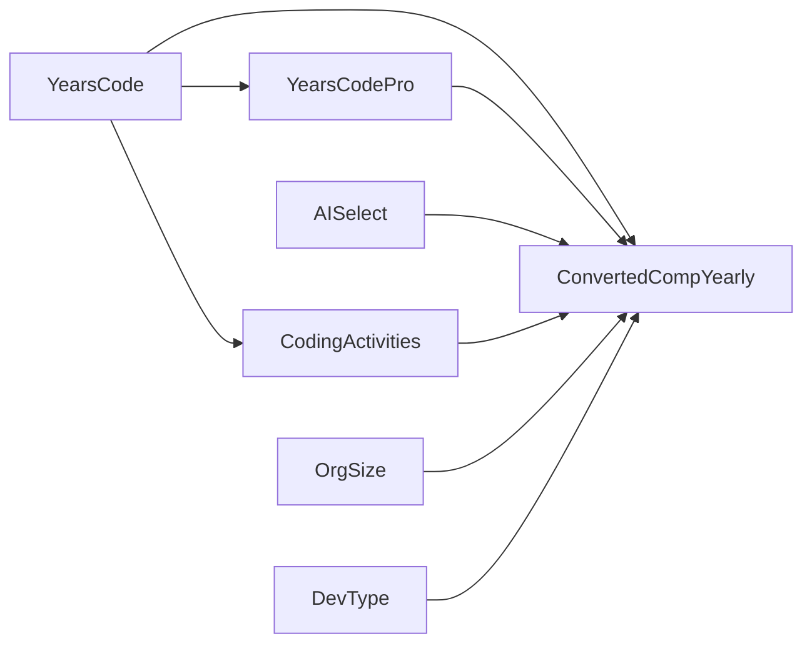

# CSE 150A: Bayesian Network for Programming Skill Prediction

## Team Members

- Lianna Lim
- Ved Panse
- William Diego
- Ioanna Gkerdouki
- Iha Gadiya

## Dataset

We used the Stack Overflow Developer Survey 2023 dataset from Kaggle:
https://www.kaggle.com/datasets/mahdialfred/stack-overflow-developer-survey-2023

Our cleaned dataset is in `cleaned_data/cleaned_stackoverflow_bn_data.csv`. The data cleaning work is in `src/data_cleaning.ipynb`, and the Bayesian Network code is in `src/bayesian_net.ipynb`.

## PEAS Analysis and Problem Background

Our project is about predicting a developer's programming skill category from survey variables. The survey does not directly ask for "programming skill," so we use yearly compensation (`ConvertedCompYearly`) as a proxy. This is not a perfect measure of skill, but it is a useful outcome variable because compensation is often related to experience, role, and professional ability.

PEAS:

- **Performance measure:** Accuracy when predicting the compensation/skill category on held-out test data. We also compare against a majority-class baseline.
- **Environment:** Professional developers from the United States who work at companies with 1,000 to 4,999 employees.
- **Actuators:** The agent outputs a probability distribution over compensation/skill categories and predicts the most likely category.
- **Sensors:** `AISelect`, `YearsCode`, `YearsCodePro`, `CodingActivities`, `DevType`, `OrgSize`, and `ConvertedCompYearly`.

The problem we are solving is: given a developer's experience, AI tool usage, role, and coding activity, how likely are they to fall into each compensation/skill category?

Probabilistic modeling makes sense here because the relationship is uncertain. For example, two developers can both have 10+ years of coding experience but still have different salaries because of their role, company, practice habits, or other factors not in the dataset. A Bayesian Network is useful because it lets us represent these uncertain relationships and ask probability questions such as:

```text
P(ConvertedCompYearly | AISelect = yes)
```

## Data Preprocessing

We started with the full Stack Overflow survey and narrowed it down so that the final dataset was more consistent. We kept rows where:

- `Country` was `United States of America`
- `OrgSize` was `1,000 to 4,999 employees`
- `DevType` contained `Developer`
- The selected columns did not have missing values

After cleaning, the final dataset has **1,106 rows**.

### Variables Used

| Variable | Values after cleaning | Role |
| --- | --- | --- |
| `Country` | `USA` | Used for filtering; dropped before training because it is constant |
| `OrgSize` | `medium_size` | Company size; kept in the model, but it is constant after filtering |
| `DevType` | `full_stack`, `back_end`, `front_end`, `mobile`, `applications`, `embedded`, `qa`, `advocate`, `game_graphics`, `experience` | Developer role |
| `AISelect` | `yes`, `no`, `plan_to` | Whether the developer uses or plans to use AI tools |
| `YearsCode` | `low`, `medium`, `high` | Total coding experience |
| `YearsCodePro` | `low`, `medium`, `high` | Professional coding experience |
| `CodingActivities` | `codes_as_hobby`, `no_code_as_hobby` | Whether the developer codes outside work |
| `ConvertedCompYearly` | `low`, `medium`, `high`, `very_high` | Target variable; used as our skill proxy |

### Dataset Exploration

The most important counts in the cleaned data were:

| Variable | Counts |
| --- | --- |
| `DevType` | full_stack 512, back_end 304, applications 80, front_end 77, embedded 44, mobile 38, and smaller groups for the rest |
| `AISelect` | no 422, yes 388, plan_to 296 |
| `YearsCode` | high 830, medium 274, low 2 |
| `YearsCodePro` | high 596, medium 422, low 88 |
| `CodingActivities` | codes_as_hobby 784, no_code_as_hobby 322 |
| `ConvertedCompYearly` | very_high 312, medium 280, low 273, high 241 |

The target classes are fairly balanced because we used quartiles for compensation: `very_high` is 28.21%, `medium` is 25.32%, `low` is 24.68%, and `high` is 21.79%.

### Thresholding and Discretization

Bayesian Networks with CPTs need discrete variables, so we discretized the numeric-like fields.

For `YearsCode` and `YearsCodePro`, we converted text responses first:

- `"Less than 1 year"` became `0.5`
- `"More than 50 years"` became `51`

Then we used these bins:

- `low`: fewer than 3 years
- `medium`: 3 to fewer than 10 years
- `high`: 10 or more years

We chose these cutoffs because they roughly separate beginner, intermediate, and experienced developers. One limitation is that after filtering, only 2 rows are in the `YearsCode = low` group, so this state is very sparse.

For `ConvertedCompYearly`, we used quartiles:

- `low`: below Q1
- `medium`: Q1 to below the median
- `high`: median to below Q3
- `very_high`: Q3 and above

We used quartiles instead of fixed salary ranges because the salary distribution is skewed, and quartiles give us a more balanced target variable.

We also simplified two survey fields. `CodingActivities` became whether the respondent codes as a hobby, and `AISelect` became `yes`, `no`, or `plan_to`.

## Bayesian Network Structure

Our final DAG is:



We chose `YearsCode -> YearsCodePro` because total coding experience usually comes before professional experience. We also chose `YearsCode -> CodingActivities` because coding experience may be related to whether someone codes outside of work.

`ConvertedCompYearly` is the target node. Its parents are `YearsCode`, `YearsCodePro`, `AISelect`, `CodingActivities`, `OrgSize`, and `DevType`. We chose these because salary can reasonably depend on experience, AI tool use, outside coding activity, company size, and role. We kept the network fairly simple because a more complicated DAG would make the CPTs harder to estimate with only 1,106 rows.

## Conditional Independence Testing

We used chi-square tests on contingency tables to check some of the main relationships before finalizing the graph.

| Relationship tested | Chi-square | p-value | What we took from it |
| --- | ---: | ---: | --- |
| `YearsCode` vs. `YearsCodePro` | 486.7506 | < 0.0001 | Strong relationship, so we kept `YearsCode -> YearsCodePro` |
| `AISelect` vs. `ConvertedCompYearly` | 1.7813 | 0.9387 | Weak pairwise relationship, but we kept it because AI usage is our main project question |
| `YearsCode` vs. `CodingActivities` | 8.3280 | 0.0155 | Some evidence of a relationship, so we kept `YearsCode -> CodingActivities` |
| `DevType` vs. `ConvertedCompYearly` | 76.1941 | < 0.0001 | Strong relationship, so we kept `DevType -> ConvertedCompYearly` |

The strongest statistical support was for experience-related variables and developer role. The AI edge is less supported by this pairwise test, so our results about AI should be interpreted carefully.

## Parameter Learning

The model learns Conditional Probability Tables (CPTs) from the training data. We used Maximum Likelihood Estimation through pgmpy.

For a node \(X\) with parents \(Pa(X)\), the CPT is computed as:

```text
P(X = x | Pa(X) = u) = count(X = x and Pa(X) = u) / count(Pa(X) = u)
```

For a root node, the formula is:

```text
P(X = x) = count(X = x) / N
```

We used a 70/30 train-test split with `random_state=42`. This gave us **774 training rows** and **332 test rows**. The fitted model passed `model.check_model()`, so the learned CPTs formed a valid Bayesian Network.

## Training Code

The full code is in `src/bayesian_net.ipynb`. The main training code is:

```python
from pgmpy.models import DiscreteBayesianNetwork
from pgmpy.parameter_estimator import DiscreteMLE
from pgmpy.inference import VariableElimination
from sklearn.model_selection import train_test_split
import pandas as pd

data = pd.read_csv("../cleaned_data/cleaned_stackoverflow_bn_data.csv")
data = data.drop(columns=["Country"])

edges = [
    ("YearsCode", "YearsCodePro"),
    ("YearsCode", "CodingActivities"),
    ("YearsCode", "ConvertedCompYearly"),
    ("YearsCodePro", "ConvertedCompYearly"),
    ("AISelect", "ConvertedCompYearly"),
    ("CodingActivities", "ConvertedCompYearly"),
    ("OrgSize", "ConvertedCompYearly"),
    ("DevType", "ConvertedCompYearly"),
]

model = DiscreteBayesianNetwork(edges)
train_data, test_data = train_test_split(data, test_size=0.3, random_state=42)
model.fit(train_data, estimator=DiscreteMLE())
inference = VariableElimination(model)
```

pgmpy is the library we used to create the Bayesian Network, learn the CPTs, check that the model is valid, and run inference with variable elimination.

## Inference Examples

Here are three example queries from the trained model.

### Query 1: AI tool users

`P(ConvertedCompYearly | AISelect = yes)`

| Category | Probability |
| --- | ---: |
| high | 0.2453 |
| low | 0.2168 |
| medium | 0.2483 |
| very_high | 0.2896 |

### Query 2: Non-users

`P(ConvertedCompYearly | AISelect = no)`

| Category | Probability |
| --- | ---: |
| high | 0.2036 |
| low | 0.2494 |
| medium | 0.2777 |
| very_high | 0.2693 |

### Query 3: High professional experience and AI use

`P(ConvertedCompYearly | YearsCodePro = high, AISelect = yes)`

| Category | Probability |
| --- | ---: |
| high | 0.2468 |
| low | 0.1386 |
| medium | 0.2418 |
| very_high | 0.3728 |

The model gives AI users a slightly higher probability of being in the `very_high` category than non-users, but the difference is small. The query with high professional experience has a clearer effect: `very_high` increases to 0.3728.

## Evaluation Results

For each row in the test set, we used all variables except `ConvertedCompYearly` as evidence and predicted the category with the highest posterior probability. Two test rows had unseen states from training, so they were skipped.

| Metric | Value |
| --- | ---: |
| Test rows | 332 |
| Valid predictions | 330 |
| Skipped rows | 2 |
| Correct predictions | 115 |
| Bayesian Network accuracy | 34.85% |
| Majority-class baseline accuracy | 29.52% |
| Improvement over baseline | +5.3 percentage points |

Confusion matrix:

| Actual \ Predicted | high | low | medium | very_high |
| --- | ---: | ---: | ---: | ---: |
| high | 28 | 8 | 8 | 19 |
| low | 28 | 21 | 24 | 15 |
| medium | 31 | 6 | 21 | 23 |
| very_high | 28 | 12 | 13 | 45 |

## Results Interpretation

The Bayesian Network did better than the majority-class baseline, but only by about 5.3 percentage points. This means the model is learning some signal, but it is not a very strong predictor yet.

The model has trouble separating nearby compensation categories. This makes sense because salary is affected by many things we did not include, such as exact location, education, company pay policy, seniority level, industry, negotiation, and management responsibilities. Also, salary is only a proxy for programming skill, not a direct measurement.

The AI result should also be treated carefully. The chi-square test for `AISelect` and `ConvertedCompYearly` had a high p-value, so AI usage by itself did not show a strong relationship with compensation in this filtered dataset. The Bayesian Network query shows a small difference between AI users and non-users, but this is not enough to claim that AI tools cause higher skill or higher compensation.

## Possible Improvements

For the next milestone, these are the main changes we would consider:

- Use a larger part of the survey instead of filtering to one company-size group. Right now `OrgSize` is constant, so it cannot help much.
- Add smoothing to the CPT estimates. This would help with rare states like `YearsCode = low` and reduce unseen-state issues during testing.
- Revisit the DAG with more conditional independence tests. For example, `DevType` might affect `AISelect`, and `YearsCodePro` might affect `DevType`.
- Try different discretization choices for years of experience, since the current `low` group is too small after filtering.
- Use more evaluation metrics, such as macro F1-score and per-class precision/recall, because accuracy alone hides which classes the model struggles with.
- Use cross-validation instead of only one train-test split.
- Add more survey variables that may explain compensation, such as education, employment type, remote work, age, industry, and more specific location.
- Consider a better skill proxy if one is available. Compensation is useful, but it is influenced by many non-skill factors.

## References and Citations

- Stack Overflow Developer Survey 2023 dataset on Kaggle: https://www.kaggle.com/datasets/mahdialfred/stack-overflow-developer-survey-2023
- pgmpy documentation: https://pgmpy.org/
- scikit-learn documentation: https://scikit-learn.org/stable/
- SciPy chi-square contingency test documentation: https://docs.scipy.org/doc/scipy/reference/generated/scipy.stats.chi2_contingency.html
- NetworkX documentation: https://networkx.org/
- Matplotlib documentation: https://matplotlib.org/