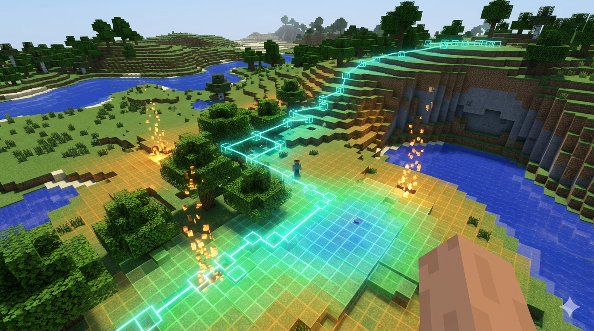

# Minecraft MDP Agent — Student Starter Kit

## Overview

You will implement a **Markov Decision Process (MDP)** agent that controls a bot
inside a live Minecraft server. The bot observes the world through structured data
(position, inventory, nearby blocks) and your job is to formalize the task as an
MDP and implement a solver.



## Setup

### 1. Install Python dependencies

```bash
pip install -r requirements.txt
```

### 2. Configure your connection

Your instructor will provide you with an **API key** and a **server URL**.

```bash
export MDP_API_KEY="your-api-key-here"
export MDP_SERVER_URL="https://tile.ucsd.edu"
export BOT_NAME="my_bot"    # optional; names your pkl snapshots (default "my_bot")
```

### 3. Run your agent

```bash
python -m student.mdp_agent
```

On start, `mdp_agent.py` looks in `results/` for the highest-episode snapshot matching `$BOT_NAME` and resumes from it. On first run the directory is empty and training starts from scratch. Snapshots are written every 5 episodes (atomic `tmp + os.replace`, so a SIGKILL mid-write can't truncate your data).

## Project Structure

```
student-starter/
├── engine/
│   ├── __init__.py
│   └── minecraft_env.py      # Gymnasium environment (DO NOT MODIFY)
├── student/
│   ├── mdp_definition.py     # ← YOU EDIT: define S, R, T, γ, terminal
│   ├── agent.py              # provided: TransitionMatrix (do not modify)
│   ├── mdp_agent.py          # ← YOU EDIT: implement PI + VI (save/load is provided)
│   └── random_agent.py       # provided demo: uniformly-random actions — run first to sanity-check the API
├── scripts/
│   └── analyze.py            # training-report generator (plots + text summary from pkls + log)
├── results/                  # created on first run; holds your pkl snapshots
└── requirements.txt
```

**You only edit files in `student/`.** Action indices and names are fetched from the bridge at startup (`env.num_actions`, `env.ACTION_NAMES`), so you never hardcode those.

## Start here — run the random agent first

Before writing any MDP code, run the reference [random agent](student/random_agent.py) to verify your setup and see how `MinecraftMDPEnv` works:

```bash
export MDP_API_KEY="your-api-key"
export MDP_SERVER_URL="https://tile.ucsd.edu"
python -m student.random_agent
```

That script does the bare minimum: connect, discover actions, observe the world, pick uniformly-random actions from whatever the bridge says is currently available, and loop for three small episodes. It prints what each call returns so you can *see* the data shape you're going to work with:

- `env.num_actions` and `env.ACTION_NAMES` — the authoritative action list, fetched from the bridge at init time. No hardcoding.
- `env.reset() → (state, info)` — start of episode; returns current state without moving the bot. Position, inventory, effects carry across episodes. `info["available_actions"]` is the `frozenset` of legal action indices right now.
- `env.peek_state() → (state, info)` — same as `reset()` but doesn't touch the Gymnasium episode counter. Useful if you want a state snapshot mid-episode.
- `env.request_reset() → (state, info)` — explicit **drift**: teleports the bot back to its assigned spawn cell (server-side, via RCON). Use only when the bot is genuinely stuck. This is NOT called automatically — the reference agent never calls it.
- `env.step(action) → (next_state, reward, terminated, truncated, info)` — one transition; you don't have to manage timing, the env blocks on the bridge's action-lock.
- `env.get_raw_state()` — the full observation dict (inventory, position, flags, nearby grid, available_actions, …). `state_fn(raw)` in `mdp_definition.py` is called automatically on this dict to produce your state tuple.

Read `random_agent.py` end-to-end — it's ~100 lines of commented reference. You are **not** supposed to base your assignment on it; `mdp_agent.py` is where the real work goes. But every API call the real agent needs is in there.

## How timing works (don't add sleeps!)

When you run the random agent you'll notice that some actions come back instantly while others take several seconds. **This is expected, not a bug, and you should not try to handle it on your side.**

### Everything is server-paced

Every `env.step(action)` call blocks until the action's real-world effect is confirmed by the bridge. There is no fire-and-forget. The HTTP POST to `/action` does not return until:

- Movement — a `physicsTick` delta > 0.1 block is observed, or a 3 s timeout hits
- Mining / placing / crafting — the underlying Mineflayer promise (`bot.dig`, `bot.placeBlock`, `bot.craft`) resolves
- Attack — an `entityHurt` event fires on the target, or a 500 ms timeout
- Fishing — `bot.fish()` resolves (can take 5–45 s)
- Hunting — the target dies, the pursuit timeout (10 s) expires, or the bot gives up

When `env.step()` returns, the action has already happened in-world. You can immediately call `env.step()` again. **No `time.sleep()` needed anywhere in your code.**

### Why some actions "take forever"

The bridge groups actions into EMA speed buckets (see [ACTIONS.md](ACTIONS.md) for the full table):

| Group | Typical | What's in it |
|---|---|---|
| `fast` | ~350 ms | movement, noop, equip_armor, toggle_door, drop_*, mount, dismount |
| `medium` | ~1 s | craft_*, attack_nearest, eat, feed, place, pick_up_*, climb_up |
| `slow` | ~3 s | all `mine_*`, `get_wood`, `sleep`, `hunt_*` |
| `very_slow` | up to 45 s | `fish` only — dedicated group so its long tail doesn't pollute the `slow` average |

The bridge measures how long each action actually took on your bot, then updates an **exponential moving average** per-group. Subsequent responses carry a `wait_ms` field that tells you the current best estimate of how long the next action in that group will take. You can ignore this field — it's a hint, not a requirement. The env has already blocked you for the full duration.

### Why you must not add sleeps

If you wrap `env.step` in `time.sleep(1)`, all you're doing is:
- Slowing down episodes (fewer (s, a, s') transitions per wall-clock second → longer to converge).
- Masking real issues (a bot that's actually stuck in a bad action for 10s looks the same as a bot that's working).
- Wasting everyone's time (bridge is already serialized per-bot; a second client for the same bot can't "get ahead" by waiting less).

The only legitimate sleep in the provided driver is **after an exception** — `time.sleep(5)` in the episode-failure handler lets the bridge/server recover before reconnecting. That's it.

### Rate limiting is already handled

Each API key gets 60 requests/sec sustained + 10 burst. If you ever exceed this (you basically can't — `env.step` blocks for the action's duration), the server returns `429 Too Many Requests` with a `Retry-After` header and the env auto-retries transparently up to 5 times. You will never see a 429 in your own code.

### If an action takes longer than the EMA suggests

That's normal. Pathfinding to an ore seam 6 blocks away, through cluttered terrain, can spike a `mine_coal` to 8 s even though the group average is 3 s. The bridge has internal timeouts per confirmable primitive (2–5 s typically) and a 10 s overall action-lock ceiling. If something goes truly wrong, the bridge resets the lock and returns `{ confirmed: false, elapsed_ms: <actual> }`; your env.step still returns cleanly. **Just keep looping.**

## What to Implement

This is a **model-based MDP** assignment. You learn the transition matrix `T̂(s,a,s')` from experience and solve it with Bellman's equation. This is *not* Q-learning — the course is focused on classical tabular planning.

### 1. `student/mdp_definition.py`

Define three functions:

- **`state_fn(raw)`** — Convert the raw observation dict into a hashable tuple.
  The raw dict contains fields like `grid_x`, `grid_z`, `health_bin`, `has_wood`,
  `inventory`, `nearby_grid`, `time_of_day`, etc. (see Raw State Fields below).

- **`reward_fn(old_state, action, new_state)`** — Return a float reward for the
  transition. This encodes what behavior you want the agent to learn.

- **`terminal_fn(state, step_count)`** — Return True when the episode should end
  (goal reached, agent died, max steps, etc.)

- **`prior_transitions(state, action)`** — Return your initial beliefs about
  `T(s,a,s')` as `[(probability, next_state), ...]`. The agent updates these
  from real experience via count-based estimation.

### 2. `student/agent.py` (provided — do not modify)

Contains the `TransitionMatrix` class — count-based estimator for `T̂(s,a,s')` with prior fallback. Use it; don't rewrite it.

### 3. `student/mdp_agent.py`

This is where your MDP agent lives. The agent maintains one `TransitionMatrix` and uses **both planning algorithms** to optimise its policy. Implement these two functions inside the file:

- **`policy_iteration(T, R, states, num_actions, gamma)`** — initialise a random policy, alternate policy evaluation (compute `V^π`) with greedy improvement until the policy stops changing. Helper TODOs `_evaluate_policy` and `_improve_policy` are stubbed out separately so you can see the two phases distinctly.

- **`value_iteration(T, R, states, num_actions, gamma)`** — apply the Bellman optimality update `V_{k+1}(s) = max_a Σ T(s,a,s')·[R(s,a,s') + γ V_k(s')]` until convergence, then extract the greedy policy.

Both functions return `(policy, V)`. The main loop already calls both each replan, measures their agreement, and deploys VI's policy — change that line if you want to deploy PI's, alternate, or pick whichever converged faster.

Your writeup should compare PI and VI on the same `T̂`: convergence time, final agreement, behaviour in the bot.

## Checkpoints & resume — provided (you don't modify this)

`mdp_agent.py` ships with two helpers at the top:

- **`save_checkpoint(T, policy, episode, epsilon=None)`** — writes `results/<BOT_NAME>_ep<N>.pkl` atomically (`.tmp` file + `fsync` + `os.replace`). The pkl contains `T_counts`, `T_totals`, `policy`, `episode`, `epsilon`, a timestamp, and state/transition counts — everything `scripts/analyze.py` needs. **Rolling retention**: after each write, older ep-pkls for your bot are pruned so only the **latest 10** remain on disk. Over a multi-hour run this keeps `results/` bounded at ~100 MB / bot instead of growing without limit. Tune via `KEEP_LATEST_PKLS` at the top of `mdp_agent.py` if you want a denser or sparser history.
- **`load_latest_checkpoint(current_state_arity=None)`** — finds the highest-episode pkl for `$BOT_NAME` in `results/` and rebuilds a `TransitionMatrix` + policy + episode counter from it. Pass `len(state_fn({}))` to drop stale state-tuple keys when you rewrite `state_fn` mid-project (prevents planner crashes on mismatched arities).

`run()` wires both in automatically: load at start, save every 5 episodes, final save on exit. You don't need to touch either helper — they're plumbing, not assignment. If you want different save granularity, adjust `SAVE_EVERY` at the top of `mdp_agent.py`.

**Resuming across runs**: kill your bot with Ctrl-C, restart it with the same `BOT_NAME`, and training picks up from the last snapshot. Same behaviour if your bot crashes or gets disconnected — the atomic save guarantees no truncated pkls.

## Analysing your training run

`scripts/analyze.py` reads the pkl snapshots in `results/` plus your bot's stdout log and produces:

1. A text summary printed to stdout — observed states, recorded transitions, per-episode reward stats, top actions by cumulative T̂ count.
2. Four Plotly HTML charts in `results/analysis/`: reward curve + ε decay, T̂ growth (states + transitions over time), top-N action distribution, and a stacked-area timeline of action usage.

```bash
pip install plotly
python3 scripts/analyze.py                          # autodetects the bot with the most pkls
python3 scripts/analyze.py --bot-name my_bot \
    --log /tmp/my_bot.log --top-actions 20          # explicit
```

You can run this any time during training (it only reads persisted artefacts) or after it finishes. Action names are fetched live from the bridge if `MDP_API_KEY` and `MDP_SERVER_URL` are set; otherwise the script falls back to a cached 104-entry snapshot so you can run it offline without losing readable labels.

## Available Actions

Not all actions are available at all times. Crafting requires materials, combat requires a nearby mob, ore mining requires the right tool tier. Use `env.get_available_actions()` to get the `frozenset` of currently valid action indices (O(1) membership check).

The authoritative action list is defined server-side and fetched by `MinecraftMDPEnv` at startup; `env.num_actions` and `env.ACTION_NAMES` are set from the bridge, so you never hardcode action indices or names. For a complete reference including confirmation mechanisms and EMA groups, see [ACTIONS.md](ACTIONS.md).

### Movement (always available)

| Index | Name | Effect |
|-------|------|--------|
| 0 | move_north | Walk +Z one block |
| 1 | move_south | Walk -Z one block |
| 2 | move_east | Walk +X one block |
| 3 | move_west | Walk -X one block |
| 7 | noop | Wait one cycle |

### Mining & Placing (conditional)

| Index | Name | Requires |
|-------|------|----------|
| 4 | mine_below | Non-air block below + **matching tool** (shovel for dirt-family, pickaxe for stone-family, axe for wood) at the required tier. Equips the correct tool before digging; blocks two consecutive mine_below to prevent bottomless pits. |
| 5 | mine_forward | **Pickaxe-only.** Non-air pickaxe-tier block at foot-level (y=0) in front AND a matching pickaxe in inventory. Equips the pickaxe before digging. For shovel-family blocks use `dig_forward` (69). For head-level (y=+1) blocks in front use `mine_overhang` (164) / `dig_overhang` (165); for directly above see `mine_above` / `dig_above` (162-163); for forward-and-down see `mine_diagonal` / `dig_diagonal` (166-167). |
| 6 | place_forward | Item in inventory (places first stack) |
| 33 | place_torch | Torch in inventory (explicit; prefers wall-in-front, falls back to floor) |
| 50 | climb_up | dirt/cobblestone/gravel/stone in inventory (priority order) + 2 air blocks above. Pillar-jumps 1 block higher. |
| 69 | dig_forward | Shovel-family block at foot-level (y=0) in front (dirt / grass / sand / gravel / clay / soul_sand). Equips a shovel if the bot has one, otherwise digs bare-handed. Separate from `mine_forward` so the MDP can value shovel vs. pickaxe use independently. Paired with `dig_overhang` (165), `dig_above` (163), `dig_below` (161), `dig_diagonal` (167) for other vertical positions. |
| 70 | mine_stone | Targeted cobblestone channel. Scans 6-block radius for exact `stone` or `cobblestone` (granite/diorite/andesite/deepslate excluded). Requires any pickaxe. Primary source of cobblestone for `craft_stone_pickaxe`, `craft_furnace`, `craft_stone_sword`. |
| 73 | till_soil | Any hoe in inventory AND dirt / grass_block / coarse_dirt / dirt_path in front, one down in front, or directly below **with air directly above the candidate**. Equips hoe and `activateBlock`s the target into farmland. After the packet is sent the bridge polls the target block (up to 1s) and only reports `confirmed:true` if the block actually became farmland — prevents the silent-failure loop where an underground bot or a bot facing a sapling/flower repeatedly "tilled" sealed blocks. |
| 74 | plant_seed | Seed in inventory (wheat_seeds / beetroot_seeds / carrot / potato / melon_seeds / pumpkin_seeds) AND a farmland block within 4. Places the seed on top of the nearest farmland. |
| 94 | pick_up_planks | Any `*_planks` block within 3 blocks. **Always-available barehand escape kit action.** Equips an axe if one exists in inventory (explicit `endsWith("_axe")` to exclude pickaxes); otherwise bare hand. Breaks the plank and auto-collects the drop. Lets a bot recover its own `place_forward` pedestal. |
| 95 | hit_vegetation | Any allow-listed obstruction plant within 3 blocks: leaves (all wood variants + azalea), vines, cave_vines, weeping_vines, twisting_vines, glow_lichen, mangrove_roots, cobweb, dead_bush. **Always-available barehand escape kit action.** Equips shears if present; otherwise bare hand. **Excludes** grass / tall_grass / fern (seed source), seagrass / kelp (food source), saplings (regrowth), and flowers (decorative) — so the policy can't discover "destroy grass to escape" as a wheat_seeds denial. Primary purpose: break out of a leaf cage after `chop_wood` strands the bot on a tree canopy. |
| 96 | break_nodrop | Any non-air/bedrock/water/lava block in front (foot or head level) or directly below. **Universal escape action.** Uses whatever is currently in hand — does NOT call `bot.equip` (would fail if inventory is full). Drops are NOT suppressed; whatever falls is picked up normally. Primary purpose: break out of a stone enclosure after the bot loses its pickaxe — `mine_forward` requires a pickaxe for drops, `break_nodrop` doesn't require anything. |
| 97 | place_chest | `chest` in inventory AND at least one of the 6 candidate placement faces (front/below/4 sides) has a valid air target + solid reference AND no other chest within 4 blocks. Deploys a chest to act as an inventory overflow. Pairs with `deposit_chest` (111) / `withdraw_chest` (112) for full storage loop. |
| 98 | cook_start | Furnace within 4 AND at least one COOK_INPUT in inventory (raw beef / porkchop / chicken / mutton / rabbit / cod / salmon / potato / kelp) AND fuel. Opens furnace → deposits 1 food + fuel → closes. **Stateless atomic.** |
| 99 | cook_collect | **Session-gated.** Available only when a furnace session is open (via peek_furnace, 102) AND `session.furnace.outputItem().name` is a cooked food (cooked_beef / cooked_porkchop / cooked_chicken / cooked_mutton / cooked_rabbit / cooked_cod / cooked_salmon / baked_potato / dried_kelp). Takes output, closes session. |
| 100 | smelt_iron_start | Furnace within 4 AND raw_iron / iron_ore / deepslate_iron_ore in inventory AND fuel. Dedicated iron channel, separate from the minor smelt. Stateless atomic. |
| 101 | smelt_iron_collect | **Session-gated.** Available only when the open furnace's live output is `iron_ingot`. Feeds the `craft_iron_pickaxe` → diamond chain. |
| 102 | peek_furnace | Furnace within 4 AND no existing furnace session for this bot. Opens the furnace window server-side and **holds it open**. The bridge stores `{furnace, block, openedAt}` in a per-bot session map. **While session is active**, `getAvailableActions` restricts the bot's action set to `{close_furnace (103), smelt_collect (37), cook_collect (99), smelt_iron_collect (101)}` — each collect is present only if its category filter matches the live output slot. Every other action is masked out. Session auto-closes after 60s safety timeout. |
| 103 | close_furnace | Always available when a furnace session is active. Closes the session (frees the action mask back to normal). |
| 104 | craft_smoker | 4 logs (any variants — tag-aware, mixable) + 1 furnace in inventory AND crafting_table within 4. Crafts a smoker. Smokers cook food 2× faster than furnaces; the cook_* actions still target regular furnaces (smoker integration is a follow-up). |
| 105 | place_smoker | `smoker` in inventory AND valid placement face AND no other smoker within 4. Deploys a smoker. |
| 106 | smoke_wood | Furnace within 4 AND at least one log variant (oak/birch/spruce/dark_oak/acacia/jungle/mangrove/cherry) AND fuel. Dedicated log → charcoal smelt channel. Output `charcoal` retrieved via `smelt_collect` (37) by output filter. |
| 107 | smelt_cobblestone | Furnace within 4 AND cobblestone in inventory AND fuel. Dedicated cobblestone → stone smelt channel. Output `stone` retrieved via `smelt_collect` (37). |
| 108 | smelt_stone | Furnace within 4 AND stone in inventory AND fuel. Dedicated stone → smooth_stone smelt channel. Output `smooth_stone` retrieved via `smelt_collect` (37). Required upstream step for `craft_blast_furnace` (109). |
| 109 | craft_blast_furnace | 5 iron_ingot + 1 furnace + 3 smooth_stone in inventory AND crafting_table within 4. 3×3 recipe. Crafts a blast_furnace (smelts ingots 2× faster than a regular furnace — ingots only; food still needs a smoker). |
| 110 | place_blast_furnace | `blast_furnace` in inventory AND valid placement face AND no other blast_furnace within 4 blocks. Deploys a blast furnace. |
| 111-160 | **Chest deposit/withdraw family** (50 actions) | Every deposit has a matching withdraw. All gates are **server-side** — deposit gates on `inventory[item] > 0`; withdraw gates on chest presence (optimistic) or an open chest session's contents. Each call moves up to one slot (64 for bulk items, 1 for tools). See the "Chest session lifecycle" note below for how consecutive chest actions batch. |
| 111-116 | **Bulk materials** | `deposit/withdraw_cobblestone` (111-112), `_gravel` (113-114), `_dirt` (115-116). Mirror of `drop_cobblestone/gravel/dirt` at 42-44. |
| 117-120 | **Food** | `deposit/withdraw_food_raw` (117-118) covers `beef`, `porkchop`, `chicken`, `mutton`, `rabbit`, `cod`, `salmon`, `potato`, `kelp`. `_food_cooked` (119-120) covers cooked versions plus `bread`, `baked_potato`, `dried_kelp`, `apple`. Action deposits/withdraws the first matching item in that category. |
| 121-160 | **Tool matrix (4 materials × 5 types)** | `deposit/withdraw_<material>_<type>` for `material ∈ {wooden, stone, iron, diamond}` × `type ∈ {pickaxe, sword, axe, shovel, hoe}`. 40 actions total. Names mirror `craft_<material>_<type>`. |

#### Chest session lifecycle (how deposit/withdraw actions stack)

The bridge keeps a per-bot **chest session** so consecutive deposit/withdraw actions do **not** each pay the open+close cost.

1. The **first** chest action (any `deposit_*` or `withdraw_*`) opens the nearest chest and caches the window handle on the bot. This is the ~800 ms path (pathfind + `openContainer`).
2. **Each subsequent** chest action — same bot, same chest — reuses the cached handle. A deposit or withdraw call in this state is ~50-100 ms: no walking, no packet re-handshake.
3. So a policy that fires `deposit_cobblestone` four times in a row to empty a 256-count stack does:
   - call 1: open chest + deposit 64  (≈ 800 ms)
   - call 2: deposit 64  (≈ 80 ms, reused session)
   - call 3: deposit 64  (≈ 80 ms, reused session)
   - call 4: deposit 64  (≈ 80 ms, reused session)
   - = one `openContainer`, four deposits, zero intermediate closes.
4. The session **closes** as soon as the bot fires any **non-chest action**. Concretely, if the next action is `noop` (7), `move_north` (0), `craft_sticks` (9), `mine_coal` (23), or anything else that is not a `deposit_*` / `withdraw_*` — the `/action` handler closes the chest window before executing it.
5. The session also auto-closes after **10 s idle** between chest calls, or **60 s max** total session duration (safety caps — rarely hit in practice).
6. If the bot walks out of range of the cached chest and the next chest action targets a different chest, the old session is closed and a new one opens on the new chest.

Practical consequence: a chain like `deposit_cobblestone` × 4 → `deposit_stone_pickaxe` → `withdraw_iron_ingot` → `noop` does **one** openContainer (at the start) and **one** close (at the noop). The five chest operations in between are all fast-path. Drop `noop` for any other non-chest action and you get the same shape.

### Targeted ore mining (conditional — ore nearby AND correct pickaxe tier)

Each scans a 6-block radius in all directions. Pathfinds within dig range, equips the best-tier matching pickaxe, digs.

| Index | Name | Tier | Also matches |
|-------|------|------|--------------|
| 23 | mine_coal | wooden+ | deepslate_coal_ore |
| 24 | mine_iron | stone+ | deepslate_iron_ore, raw_iron_block |
| 25 | mine_copper | stone+ | deepslate_copper_ore |
| 26 | mine_gold | iron+ | nether_gold_ore, deepslate_gold_ore |
| 27 | mine_redstone | iron+ | deepslate_redstone_ore |
| 28 | mine_lapis | stone+ | deepslate_lapis_ore |
| 29 | mine_diamond | iron+ | deepslate_diamond_ore |
| 30 | mine_emerald | iron+ | deepslate_emerald_ore |

### Crafting (conditional — requires materials)

Recipes that use only a 2×2 grid (planks, sticks, crafting_table, torch, wooden_sword, wooden_shovel) don't need a crafting table. Everything else is a 3×3 recipe and requires a crafting table within 4 blocks. Any plank variant (oak, spruce, birch, etc.) is accepted for recipes that require planks — the bridge treats them as interchangeable.

**Wooden tier:**

| Index | Name | Requires |
|-------|------|----------|
| 8 | craft_planks | Any log in inventory |
| 9 | craft_sticks | 2+ planks |
| 10 | craft_crafting_table | 4+ planks (crafts + auto-places the block) |
| 11 | craft_wooden_pickaxe | 3 planks + 2 sticks + crafting table nearby |
| 13 | craft_wooden_sword | 2 planks + 1 stick + crafting table nearby |
| 19 | craft_wooden_axe | 3 planks + 2 sticks + crafting table nearby |
| 20 | craft_wooden_shovel | 1 plank + 2 sticks + crafting table nearby |
| 71 | craft_wooden_hoe | 2 planks + 2 sticks + crafting table nearby |
| 32 | craft_torch | 1 coal/charcoal + 1 stick |

**Stone tier** (requires wooden pickaxe upstream to mine cobblestone):

| Index | Name | Requires |
|-------|------|----------|
| 12 | craft_stone_pickaxe | 3 cobblestone + 2 sticks + crafting table nearby |
| 22 | craft_stone_sword | 2 cobblestone + 1 stick + crafting table nearby |
| 72 | craft_stone_hoe | 2 cobblestone + 2 sticks + crafting table nearby |
| 75 | craft_stone_axe | 3 cobblestone + 2 sticks + crafting table nearby |
| 76 | craft_stone_shovel | 1 cobblestone + 2 sticks + crafting table nearby |
| 21 | craft_furnace | 8 cobblestone + crafting table nearby (unlocks smelting) |

**Iron tier** (requires smelted iron_ingot — use `smelt_start` on raw_iron):

| Index | Name | Requires |
|-------|------|----------|
| 77 | craft_iron_pickaxe | 3 iron_ingot + 2 sticks + crafting table nearby |
| 78 | craft_iron_axe | 3 iron_ingot + 2 sticks + crafting table nearby |
| 79 | craft_iron_sword | 2 iron_ingot + 1 stick + crafting table nearby |
| 80 | craft_iron_shovel | 1 iron_ingot + 2 sticks + crafting table nearby |
| 81 | craft_iron_hoe | 2 iron_ingot + 2 sticks + crafting table nearby |

**Diamond tier** (requires iron pickaxe to mine diamond ore):

| Index | Name | Requires |
|-------|------|----------|
| 82 | craft_diamond_pickaxe | 3 diamond + 2 sticks + crafting table nearby |
| 83 | craft_diamond_axe | 3 diamond + 2 sticks + crafting table nearby |
| 84 | craft_diamond_sword | 2 diamond + 1 stick + crafting table nearby |
| 85 | craft_diamond_shovel | 1 diamond + 2 sticks + crafting table nearby |
| 86 | craft_diamond_hoe | 2 diamond + 2 sticks + crafting table nearby |

**Utility crafts:**

| Index | Name | Requires |
|-------|------|----------|
| 87 | craft_bread | 3 wheat + crafting table nearby |
| 88 | craft_chest | 8 planks + crafting table nearby |
| 89 | craft_bed | 3 wool + 3 planks + crafting table nearby (output: white_bed) |
| 90 | craft_shield | 6 planks + 1 iron_ingot + crafting table nearby |
| 91 | craft_bow | 3 sticks + 3 string + crafting table nearby |
| 92 | craft_flint_and_steel | 1 iron_ingot + 1 flint + crafting table nearby |
| 93 | craft_bucket | 3 iron_ingot + crafting table nearby |
| 185 | craft_stone_bricks | 4 stone (smelted cobblestone) — 2×2, no table needed |

### Smelting (conditional — furnace within 4)

| Index | Name | Requires |
|-------|------|----------|
| 36 | smelt_start | **Minor smelt channel** (narrowed). Furnace within 4 + at least one SMELT_MINOR_INPUT (raw_copper / raw_gold / copper_ore / gold_ore / deepslate variants / sand / red_sand / cobblestone / clay_ball) + fuel. Stateless atomic (open → deposit → close). Iron goes through action 100; cooking through action 98. |
| 37 | smelt_collect | **Minor smelt channel, session-gated.** Available only when a furnace session is open (via peek_furnace, 102) AND the live `outputItem().name` matches SMELT_MINOR_OUTPUTS (copper_ingot / gold_ingot / glass / stone / brick). Takes output and closes the session. |

### Survival (conditional)

| Index | Name | Requires |
|-------|------|----------|
| 15 | eat | Food in inventory + not full hunger |
| 16 | feed_animal | Animal within 4 blocks + matching food (seeds→chicken, wheat→cow, carrot/potato→pig) |
| 34 | equip_armor | Armor piece in inventory that beats what's currently worn in that slot |
| 35 | sleep | Nighttime + bed within 8 + no mob within 8 |
| 38 | fish | Fishing rod in inventory + water within 3 blocks. Long action (up to 45s). |
| 41 | toggle_door | Door / trapdoor / fence_gate within 4 |
| 47 | drink_potion | Healing/regen potion in inventory + health < 20 |

### Wood / Crops / Livestock (conditional)

| Index | Name | Requires |
|-------|------|----------|
| 17 | get_wood | Log block within 2 blocks, no axe equipped (slow, bare-hand) |
| 18 | chop_wood | Log block within 2 blocks, axe equipped (fast) |
| 31 | farm_nearest | Mature crop (wheat/carrots/potatoes/beetroots) within 6 blocks |
| 39 | shear_sheep | Shears in inventory + sheep within 4 |
| 40 | milk_cow | Bucket in inventory + cow within 4 |

### Combat (conditional)

| Index | Name | Requires |
|-------|------|----------|
| 14 | attack_nearest | Hostile mob within 5 blocks (equips sword if present) |
| 45 | shoot_arrow | Bow + arrow + mob within 10 blocks (full-draw charge) |
| 46 | raise_shield | Shield in inventory + hostile mob within 4 (1s block) |

### Hunting animals (conditional — weapon required)

Each hunts a specific species within 10 blocks. Pursues the animal up to 10 seconds; gives up cleanly if the animal outruns the bot (EMA still records real elapsed time).

Weapon priority (any works): **sword > axe > bow + arrow**.

| Index | Name | Drops |
|-------|------|-------|
| 51 | hunt_cow | raw_beef, leather |
| 52 | hunt_pig | raw_porkchop |
| 53 | hunt_chicken | raw_chicken, feather |
| 54 | hunt_sheep | raw_mutton, wool (use `shear_sheep` first to keep the sheep alive for repeat wool) |
| 55 | hunt_rabbit | raw_rabbit, rabbit_hide |

**Disabled by default**: `attack_villager` (56) and `attack_player` (57); see [ACTIONS.md](ACTIONS.md#disabled-actions).

### Item pickup (conditional — drop must be nearby)

Mineflayer auto-collects items within ~1 block of the bot, but won't walk to drops left behind after mining. These actions fill that gap. Scans an 8-block radius for the nearest dropped item matching the category.

| Index | Name | Category |
|-------|------|----------|
| 58 | pick_up_meat | Raw + cooked meats (beef, porkchop, chicken, mutton, rabbit, fish) |
| 59 | pick_up_ore | Coal, ingots, raw ores, gems (diamond, emerald, lapis, redstone, quartz) |
| 60 | pick_up_material | Logs, planks, stone, cobblestone, dirt, sticks, crops, feathers, leather, wool, string, bone |

### Inventory management (conditional — avoid dropping tools!)

Only available when inventory is nearly full (≥30 of 36 slots used) AND the target stack ≥64. Drops up to 32 items.

| Index | Name | Requires |
|-------|------|----------|
| 42 | drop_cobblestone | ≥64 cobblestone + inventory nearly full |
| 43 | drop_gravel | ≥64 gravel + inventory nearly full |
| 44 | drop_dirt | ≥64 dirt + inventory nearly full |

### Transportation (conditional)

| Index | Name | Requires |
|-------|------|----------|
| 48 | mount | Tamed horse / saddled pig / boat / minecart within 3 blocks + not already mounted |
| 49 | dismount | Currently mounted |

## Raw State Fields

When you call `env.get_raw_state()`, you get a dict with:

| Field | Type | Description |
|-------|------|-------------|
| `grid_x`, `grid_z` | int | Discretized position on the grid |
| `x`, `y`, `z` | int | Exact block position |
| `health_bin` | 0-3 | 0=critical, 1=low, 2=ok, 3=full |
| `has_wood` | bool | Any log in inventory |
| `has_planks` | bool | Any planks in inventory |
| `has_sticks` | bool | Sticks in inventory |
| `has_stone` | bool | Cobblestone in inventory |
| `has_wood_tools` | bool | **`wooden_pickaxe` in inventory specifically** — this is the tech-tree gate for `mine_coal` (wooden+ pickaxe needed). Does NOT flip on wooden_axe/sword/shovel/hoe alone, because those tools don't unlock mining progression. If you want per-tool-type flags (e.g. `has_wooden_axe`) compute them yourself from `raw_state["inventory"]` in your `state_fn`. |
| `has_stone_tools` | bool | **`stone_pickaxe` in inventory specifically** — tech-tree gate for `mine_iron` / `mine_copper` / `mine_lapis` (stone+ pickaxe needed). Does NOT flip on stone_axe/sword/shovel/hoe alone. |
| `has_sword` | bool | Any sword in inventory |
| `has_food` | bool | Any food item (apple, meat, bread, etc.) |
| `has_raw_meat` | bool | Uncooked meat in inventory |
| `has_cooked_food` | bool | Any cooked food item |
| `has_fish` | bool | Fish in inventory |
| `has_seeds` | bool | Any seed type in inventory |
| `has_seaweed` | bool | Kelp or seagrass |
| `has_apple` | bool | Apple in inventory |
| `has_bread` | bool | Bread in inventory |
| `has_wheat` | bool | Wheat in inventory |
| `has_furnace` | bool | Furnace in inventory |
| `mob_kills` | int | Total mobs killed by this bot |
| `death_count` | int | Times this bot has died |
| `is_dead` | bool | Currently dead (health = 0) |
| `water_north` / `_south` / `_east` / `_west` / `_below` | bool | Water, lava, kelp, or seagrass in that direction (1 block away). Use these to learn drowning-avoidance. |
| `water_adjacent` | bool | True if water is in any cardinal direction. Convenient catch-all for the five above. |
| `has_table_nearby` | bool | A crafting table is within 4 blocks. Gates 3×3 crafts on the bridge side; also useful as a state bit to value "I'm at a workbench". |
| `has_furnace_nearby` | bool | A furnace is within 4 blocks. Gates `smelt_start` (36) / `cook_start` (98) / `smelt_iron_start` (100) / `peek_furnace` (102). Collect actions (37/99/101) and `close_furnace` (103) gate on the bot having an active furnace **session** open, not just proximity. |
| `has_farmland_nearby` | bool | A farmland block (tilled soil) is within 4 blocks. Required for `plant_seed`. |
| `on_grass` | bool | Block directly beneath the bot is grass/podzol/mycelium/dirt_path. Breaking grass in Minecraft has a chance to drop `wheat_seeds`. |
| `unique_block_types` | int | Number of distinct item types in inventory |
| `inv_full` | bool | ≤6 of 36 inventory slots are empty (bag nearly full). |
| `cliff_loc` | int 0-255 | 8-bit directional cliff sensor. Each bit = 1 if the 1-cell offset in that direction has a drop of ≥7 blocks (at mid HP this is the fall-damage death threshold). Bit layout LSB-first: N=bit 0, NE=bit 1, E=bit 2, SE=bit 3, S=bit 4, SW=bit 5, W=bit 6, NW=bit 7. This is **state, not a movement mask** — the bot is free to walk off cliffs; the policy must learn to weigh fall damage against the reward of doing so. |
| `inventory` | dict | Full inventory `{item_name: count}` |
| `time_of_day` | str | `"day"` or `"night"` |
| `nearby_grid` | list[list] | 5x5 block names at foot level |
| `nearby_entities` | list | Nearby mobs/players with distance |
| `available_actions` | list[int] | Action indices currently executable |

### Sizing your state tuple

You control which of these fields end up in the tuple returned by `state_fn`. **Smaller is faster, larger is more expressive.** Guidelines:

- `grid_x`, `grid_z` are continuous-ish; bucket them with `// BUCKET_SIZE` so the state space stays finite. A bucket size of ~10 blocks is a good starting point.
- Boolean inventory flags are cheap; each one multiplies the state space by 2.
- `health_bin` (0–3) multiplies the state space by 4. `time_of_day` (`"day"` / `"night"`) multiplies by 2 — it captures the Minecraft day/night cycle (hostile mob spawns, sleep availability, etc. are phase-dependent on the server). Integer/categorical fields scale the tuple linearly; add deliberately.
- Don't put `inventory` (the dict) or `nearby_grid` (the list) directly in the state tuple — they're not hashable in a stable way and would blow up the state space.

The reference solution's tuple is roughly 16 elements wide; many assignments work fine with 8–12. You can add a feature, verify the agent converges, then iterate. Adding a single new bool after you already have a working policy roughly *doubles* the number of (state, action, next_state) transitions you need to observe before the Bellman update has meaningful support — so add features deliberately.

### Walkthrough: going from `raw` dict to state tuple

Suppose you want your agent to learn "collect wood, then make planks". The relevant fields in `raw` are `grid_x`, `grid_z`, `has_wood`, `has_planks`. Your `state_fn` becomes:

```python
from student.mdp_definition import BUCKET_SIZE  # e.g. 10

def state_fn(raw: dict) -> tuple:
    gx = (raw.get("grid_x") or 0) // BUCKET_SIZE
    gz = (raw.get("grid_z") or 0) // BUCKET_SIZE
    return (
        gx, gz,
        bool(raw.get("has_wood", False)),
        bool(raw.get("has_planks", False)),
    )
```

The tuple is `(int, int, bool, bool)`. A bot at world position (47, 73, −83) with one oak log in inventory yields `(4, -9, True, False)`. The bridge bucket is 10 blocks, so any movement within a 10×10 cell maps to the same state — that's the trick that keeps |S| finite.

Things to NOT put in state:
- `raw["inventory"]` (a dict) — not hashable in a stable way, and two bots holding the same items in different slot orders would look like different states.
- `raw["nearby_grid"]` (a 5×5 list of block names) — strings aren't compact; better to extract a single bool like `on_grass` that the bridge already pre-computes.
- `raw["x"]` / `raw["y"]` / `raw["z"]` unbucketed — every step becomes a new state and `T̂` never generalises.

Things to consider adding progressively:
- `health_bin` (0–3) — lets the policy learn "if low HP, eat".
- `has_wood_tools`, `has_stone`, `has_stone_tools` — tech-tree progression gates. Both tool bits key on **pickaxe ownership of that tier** (not any tool of that tier) so the policy can plan "I need a stone pickaxe before I can mine iron" cleanly.
- `water_adjacent` — terrain hazard.
- `has_table_nearby`, `has_furnace_nearby` — structural proximity (makes 3×3 crafts and smelting visible to the planner).

### Transition matrix (provided)

`TransitionMatrix` stores `T̂(s, a, s') = count(s, a, s') / count(s, a)` as a sparse nested dict keyed by your state tuples. It's sparse — a state only shows up after the bot has actually visited it. Don't worry about |S|² blowups: after ~10k episodes of training in the reference setup, a single bot's T̂ typically settles at **≈100–250 unique states** with tens of thousands of recorded transitions. Memory stays in the MB range regardless of how wide the state tuple is in principle, as long as most of the combinatorial space is unreachable in practice.

## Reward Design

Your reward function `R(s, a, s')` tells the agent what to optimize.
The Bellman equation uses these rewards to compute state values:

    V*(s) = max_a [R(s,a,s') + γ Σ P(s'|s,a) V*(s')]

Reward design is a core part of the assignment — **the specifics are yours to
work out.** Think carefully about what behaviors your policy needs.

Things worth thinking about when you design `reward_fn`:

- What should the agent do *most* of the time? A small step cost keeps it
  from wandering; too large a step cost makes it paralysed.
- What are the *rare, important* events? Milestones need rewards large
  enough to overcome however many steps it takes to reach them (remember
  the discount factor γ — a reward N steps away is worth γ^N).
- What actions do you want the agent to *avoid*? Negative rewards discourage
  them, but so does a positive reward on a *better* alternative.
- Can your reward be gamed? If two actions reach the same state bit and one
  costs less, the policy will pick the cheap one. Rewarding state-bit
  transitions is simple but can create unintended shortcuts.
- Which actions should fire every time vs. only on first occurrence? Anything
  that changes a state-bit that's already true gives no Bellman signal unless
  you pay for the action itself.

**Important:** Only reward actions that actually succeed (check that the
state actually transitioned). Rewarding unconditionally causes VI/PI to
always choose that action regardless of whether it did anything.

## Debugging Tips

- **Watch your bot**: Open Minecraft 1.20.6 and join the server to see your agent.
- **Print raw state**: Call `env.get_raw_state()` to see all available observations.
- **Slow down**: Add `time.sleep(0.5)` between steps to watch the bot move.
- **Rate limit**: The server allows 60 requests/second per API key with a 10-request burst. The env auto-retries 429s with `Retry-After` back-off, so you shouldn't need to add delays.

## Submission

Submit your `student/` folder containing:
- `mdp_definition.py` with your MDP formulation
- `agent.py` with your algorithm implementation
- `mdp_agent.py` with your training loop
- Your writeup (markdown README.md on github) with convergence plots and policy analysis
